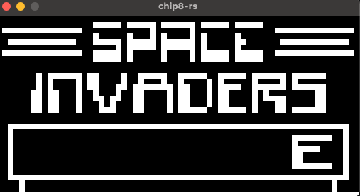

# Chip8Emulator
Chip 8 emulator I used as both an introduction to Rust and writting emulators!



## Usage
```
cargo run <path/to/rom>
```

## TODO
Beeping


# References
Things that helped me:
- [Cowgods Chip8 guide](http://devernay.free.fr/hacks/chip8/C8TECH10.HTM#Fx0A)
- [starrhorne's interpreter](https://github.com/starrhorne/chip8-rust/blob/master/src/drivers/input_driver.rs)
- [AlexEne's interpreter](https://github.com/AlexEne/rust-chip8/blob/main/src/cpu.rs)
- https://github.com/chriskonstad/chip8/blob/master/src/lib.rs
- https://github.com/chip8-rust/chip8-ui/blob/master/
